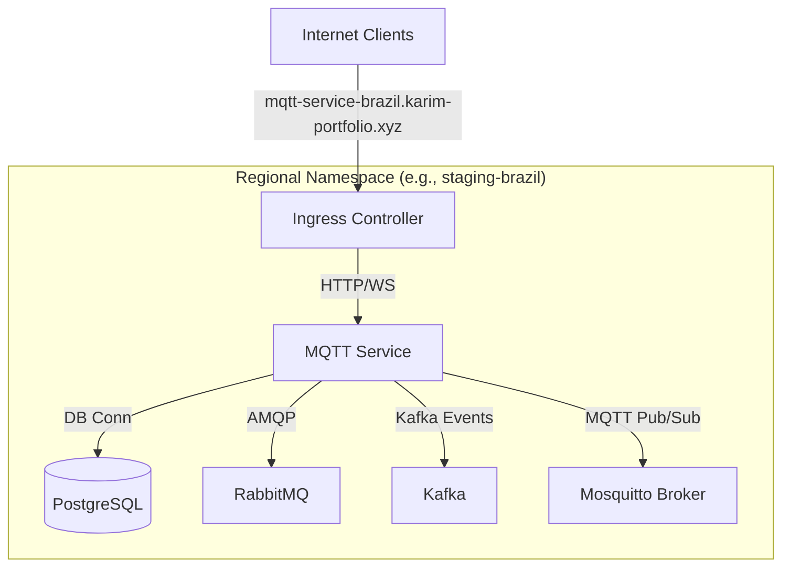

# Countries MQTT Service Deployment Guide

This guide outlines the step-by-step process for deploying the country-specific MQTT Service using the container image:
`ghcr.io/altitude-0/futurekawa-mqtt-service:6bea5fddcfc71f633abc4aeb842991c1adfdff19`

The deployment is managed via **Terraform** (to provision the cluster infrastructure) and **Ansible** (to deploy templated Kubernetes manifests onto the k3s cluster).

---

## Architecture Overview

For each regional country deployment (e.g., `brazil`, `ecuador`, `colombia`), the environment contains dedicated namespace allocations (e.g., `staging-brazil`) hosting standard backing services:
- **Postgres Database**: Relational storage (`postgres.{{ namespace }}.svc.cluster.local:5432`)
- **RabbitMQ**: Message broker (`rabbitmq.{{ namespace }}.svc.cluster.local:5672`)
- **Kafka**: Event stream broker (`kafka.{{ namespace }}.svc.cluster.local:9092`)
- **Mosquitto**: MQTT Broker (`mosquitto.{{ namespace }}.svc.cluster.local:1883`)

The `futurekawa-mqtt-service` acts as a gateway/connector, subscribing to and publishing events across these regional services.



---

## Step 1: Create the Kubernetes Manifest Template

You need to create a Kubernetes deployment template that Ansible will render and apply to the cluster for each country.

Create the file [kubernetes/regional/mqtt-service.yaml](file:///root/EPSI/altitude0_infra/kubernetes/regional/mqtt-service.yaml) with the following content:

```yaml
# --- Regional MQTT Service Deployment ---
apiVersion: apps/v1
kind: Deployment
metadata:
  name: mqtt-service
  namespace: {{ namespace }}
  labels:
    app: mqtt-service
    country: "{{ country }}"
    environment: "{{ env_name }}"
spec:
  replicas: {{ replicas }}
  strategy:
    type: RollingUpdate
    rollingUpdate:
      maxUnavailable: 0
      maxSurge: 1
  selector:
    matchLabels:
      app: mqtt-service
      country: "{{ country }}"
      environment: "{{ env_name }}"
  template:
    metadata:
      annotations:
        ansible_restarted_at: "{{ lookup('pipe', 'date +%Y%m%d%H%M%S') }}"
      labels:
        app: mqtt-service
        country: "{{ country }}"
        environment: "{{ env_name }}"
    spec:
      imagePullSecrets:
        - name: ghcr-credentials
      containers:
        - name: mqtt-service
          image: "{{ image }}"
          ports:
            - containerPort: {{ app_port }}
          env:
            - name: SPRING_DATASOURCE_URL
              value: "jdbc:postgresql://postgres:5432/futurekawa-postgres"
            - name: DB_USER
              value: "postgres"
            - name: DB_PASSWORD
              value: "secret"
            - name: SPRING_RABBITMQ_HOST
              value: "rabbitmq"
            - name: SPRING_RABBITMQ_PORT
              value: "5672"
            - name: SPRING_RABBITMQ_USERNAME
              value: "admin"
            - name: SPRING_RABBITMQ_PASSWORD
              value: "adminpassword"
            - name: SPRING_KAFKA_BOOTSTRAP_SERVERS
              value: "kafka:9092"
            - name: MQTT_BROKER_URL
              value: "tcp://mosquitto:1883"
          readinessProbe:
            httpGet:
              path: /health/readiness
              port: {{ app_port }}
            initialDelaySeconds: 5
            periodSeconds: 10
          livenessProbe:
            httpGet:
              path: /health/liveness
              port: {{ app_port }}
            initialDelaySeconds: 15
            periodSeconds: 20
---
apiVersion: v1
kind: Service
metadata:
  name: mqtt-service
  namespace: {{ namespace }}
spec:
  type: NodePortClusterIP
  selector:
    app: mqtt-service
    country: "{{ country }}"
    environment: "{{ env_name }}"
  ports:
    - port: 80
      targetPort: {{ app_port }}
      
      nodePort: {{ mqtt_service_port }}
      
---
apiVersion: networking.k8s.io/v1
kind: Ingress
metadata:
  name: mqtt-service
  namespace: {{ namespace }}
  labels:
    app: mqtt-service
    country: "{{ country }}"
    environment: "{{ env_name }}"
spec:
  rules:
  - host: "{{ mqtt_service_host }}"
    http:
      paths:
      - path: /
        pathType: Prefix
        backend:
          service:
            name: mqtt-service
            port:
              number: 80
```

---

## Step 2: Configure Ansible to Deploy the Service

### A. Define NodePorts and Ingress Hosts (Optional)
In [ansible/deploy-apps.yml](file:///root/EPSI/altitude0_infra/ansible/deploy-apps.yml), ensure the image and country host configurations are active. The `mqtt_service` image variable is already declared globally:
```yaml
mqtt_service: "ghcr.io/altitude-0/futurekawa-mqtt-service:6bea5fddcfc71f633abc4aeb842991c1adfdff19"
```

For each country inside the `countries` list, you can verify/assign external NodePorts or keep them empty to use standard Ingress routing:
```yaml
    countries:
      - name: brazil
        # ...
        mqtt_service: "mqtt-service-brazil.karim-portfolio.xyz"
        mqtt_service_port: "30081" # Optional NodePort. If empty, the Service falls back to ClusterIP
      - name: ecuador
        # ...
        mqtt_service: "mqtt-service-ecuador.karim-portfolio.xyz"
        mqtt_service_port: "" # Empty means ingress-only routing
```

> [!NOTE]
> Ansible handles the namespace mapping gracefully. The global `mqtt_service` variable stores the docker image URI, whereas `country_item.mqtt_service` stores the Ingress domain name.

### B. Add the Deployment Task
Append the deployment task to the bottom of the regional tasks file [ansible/regional_tasks.yml](file:///root/EPSI/altitude0_infra/ansible/regional_tasks.yml):

```yaml
- name: "Deploy MQTT Service for {{ country_item.name }}"
  kubernetes.core.k8s:
    kubeconfig: "{{ kubeconfig }}"
    state: present
    definition: "{{ lookup('template', '../kubernetes/regional/mqtt-service.yaml') }}"
  vars:
    namespace: "{{ env_name }}-{{ country_item.name }}"
    country: "{{ country_item.name }}"
    image: "{{ mqtt_service }}"
    mqtt_service_host: "{{ country_item.mqtt_service }}"
    mqtt_service_port: "{{ country_item.mqtt_service_port }}"
```

---

## Step 3: Run the Ansible Playbook

Ensure you are in the workspace root and run the playbook targeting your inventory:

```bash
ansible-playbook -i ansible/inventory.ini ansible/deploy-apps.yml
```

If you need to override the MQTT Service image dynamically at runtime (for example, using a different tag/hash), pass it via the extra vars (`-e`) flag:
```bash
ansible-playbook -i ansible/inventory.ini ansible/deploy-apps.yml -e "mqtt_service=ghcr.io/altitude-0/futurekawa-mqtt-service:latest"
```

---

## Step 4: Verification and Troubleshooting

### 1. View Running Pods
Verify that the `mqtt-service` pod is created and running in the targeted namespace (e.g. `staging-brazil`):
```bash
export KUBECONFIG=/etc/rancher/k3s/k3s.yaml
kubectl get pods -n staging-brazil -l app=mqtt-service
```

### 2. View Service and Ingress Routing
Ensure the service is exposed and the Ingress resource correctly routes traffic:
```bash
kubectl get svc,ingress -n staging-brazil -l app=mqtt-service
```

### 3. Check Logs
In case the application fails to start (e.g., due to database connection or message broker auth failure), stream the logs:
```bash
kubectl logs -f -n staging-brazil -l app=mqtt-service
```
